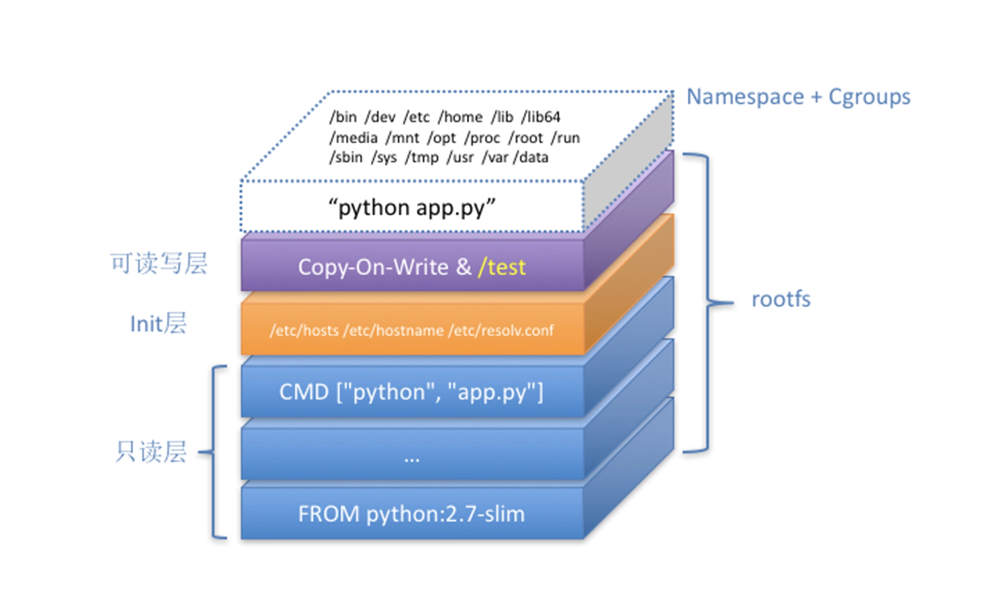

## namespace

视图隔离

Linux Namespace 官方文档在这里 [Namespace in Operation](https://lwn.net/Articles/531114/)

```c
int pid = clone(main_function, stack_size, CLONE_NEWPID | SIGCHLD, NULL); 
```

新创建的这个进程将会"看到"一个全新的进程空间，在这个进程空间里，它的 PID 是 1

```shell
$ ls /proc
```

可以查看proc各个进程信息，更多请参考 [procfs](https://en.wikipedia.org/wiki/Procfs)

## cgroups

资源限制，就是限制一个进程组能够使用的资源上限，包括 CPU、内存、磁盘、网络带宽等等。

```shell
$ ls /sys/fs/cgroup
```

测试

```shell
$ cd /sys/fs/cgroup/cpu
$ mkdir container
$ ls container/
$ while : ; do : ; done &
[1] 226
$ top
%Cpu0 :100.0 us, 0.0 sy, 0.0 ni, 0.0 id, 0.0 wa, 0.0 hi, 0.0 si, 0.0 st
$ cat /sys/fs/cgroup/cpu/container/cpu.cfs_quota_us 
-1
$ cat /sys/fs/cgroup/cpu/container/cpu.cfs_period_us 
100000 (100ms=100000us)
$ echo 20000 > /sys/fs/cgroup/cpu/container/cpu.cfs_quota_us
$ echo 226 > /sys/fs/cgroup/cpu/container/tasks 
$ top
%Cpu0 : 20.3 us, 0.0 sy, 0.0 ni, 79.7 id, 0.0 wa, 0.0 hi, 0.0 si, 0.0 st
$ kill -9 226
$ rmdir container
```

Cgroups 对资源的限制能力也有很多不完善的地方，被提及最多的自然是 `/proc` 文件系统的问题，

top 是从 `/prof/stats` 目录下获取数据，所以道理上来讲，容器不挂载宿主机的该目录就可以了。lxcfs就是来实现这个功能的，做法把宿主机的 `/var/lib/lxcfs/proc/*` 文件挂载到容器的`/proc/*`。容器中进程读取相应文件内容时，LXCFS的FUSE实现会从容器对应的Cgroup中读取正确的内存限制。从而使得应用获得正确的资源约束设定。

kubernetes环境下，也能用，以ds 方式运行 lxcfs ，自动给容器注入争取的 proc 信息。

## rootfs

[chroot](https://en.wikipedia.org/wiki/Chroot)

切换进程根目录

挂载在容器根目录上、用来为容器进程提供隔离后执行环境的文件系统，就是所谓的“容器镜像”。它还有一个更为专业的名字，叫作：rootfs（根文件系统）

[aufs](https://en.wikipedia.org/wiki/Aufs)

[overlayfs](https://en.wikipedia.org/wiki/OverlayFS)

