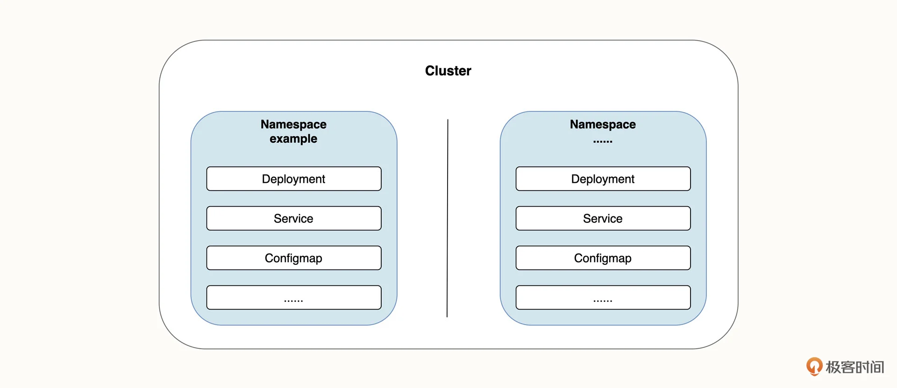

不同的命名空间具备一定的隔离性，业务应用的工作负载以及其他的 K8s 对象可以部署在特定的命名空间中，在不同命名空间中，相同类型的资源可以重名。利用这种特性，我们可以把集群虚拟的命名空间和现实中的不同团队、不同应用在逻辑上联系起来。



在一个 K8s 集群中，命名空间可以划分为两种类型：系统级命名空间和用户自定义命名空间。

系统级的命名空间是 K8s 集群默认创建的命名空间，主要用来隔离系统级的对象和业务对象，系统级的命名空间下面四种。
1. default：默认命名空间，也就是在不指定命名空间时的默认命名空间。
2. kube-system：K8s 系统级组件的命名空间，所有 K8s 的关键组件（例如 kube-proxy、coredns、metric-server 等）都在这个命名空间下。
3. kube-public：开放的命名空间，所有用户（包括未经认证）的用户都可以读取，这个命名空间是一个约定，但不是必须。
4. kube-node-lease：和集群扩展相关的命名空间。

命名空间的名字需要符合 DNS-1123 规范，其中最重要的点是字母只支持小写，另外除了特殊字符“-”以外，其他任何特殊字符都无法使用

```shell
$ kubectl get ns
$ kubectl create namespace example
$ kubectl describe namespace example
$ kubectl delete namespace example
```

```yaml
apiVersion: apps/v1
kind: Deployment
metadata:
  name: frontend
  namespace: example   # 设置 namesapce
  labels:
    app: frontend
spec:
  ......
```

```shell
kubectl apply -f deploy -n example
```