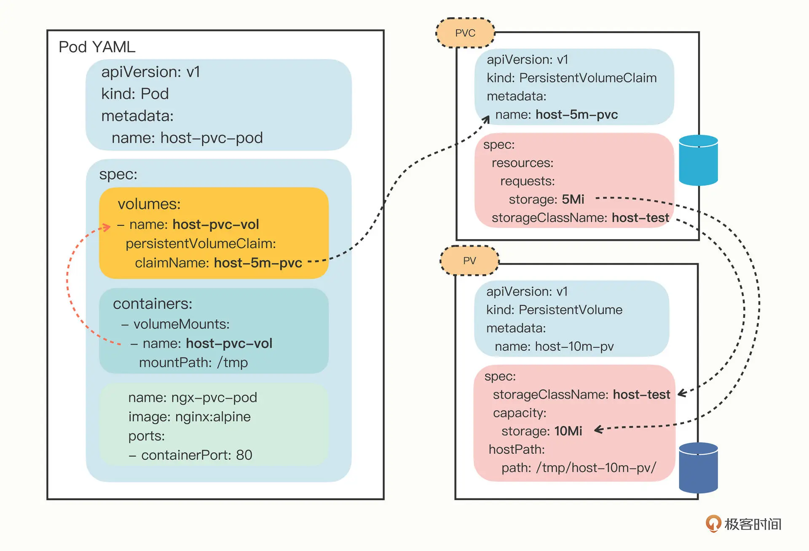

## PV (Persistent Volume)

PV 描述的，是持久化存储数据卷。这个 API 对象主要定义的是一个持久化存储在宿主机上的目录，比如一个 NFS 的挂载目录。

PV 对象是由运维人员事先创建在 Kubernetes 集群里待用的

参考 [nfs-pv.yaml]

## PV (Persistent Volume Claim)

PVC 描述的，则是 Pod 所希望使用的持久化存储的属性。比如，Volume 存储的大小、可读写权限等等。

参考 [nfs-pvc.yaml]

而用户创建的 PVC 要真正被容器使用起来，就必须先和某个符合条件的 PV 进行绑定。这里要检查的条件，包括两部分：
1. 第一个条件，当然是 PV 和 PVC 的 spec 字段。比如，PV 的存储（storage）大小，就必须满足 PVC 的要求。
2. 而第二个条件，则是 PV 和 PVC 的 storageClassName 字段必须一样。

在成功地将 PVC 和 PV 进行绑定之后，Pod 就能够像使用 hostPath 等常规类型的 Volume 一样，在自己的 YAML 文件里声明使用这个 PVC 了

参考 [web-frontend-pod.yaml]

PVC 可以理解为持久化存储的“接口”，它提供了对某种持久化存储的描述，但不提供具体的实现；而这个持久化存储的实现部分则由 PV 负责完成。这样做的好处是，作为应用开发者，我们只需要跟 PVC 这个“接口”打交道，而不必关心具体的实现是 NFS 还是 Ceph。毕竟这些存储相关的知识太专业了，应该交给专业的人去做。

而所谓将一个 PV 与 PVC 进行“绑定”，其实就是将这个 PV 对象的名字，填在了 PVC 对象的 spec.volumeName 字段上

所谓容器的 Volume，其实就是将一个宿主机上的目录，跟一个容器里的目录绑定挂载在了一起

而所谓的“持久化 Volume”，指的就是这个宿主机上的目录，具备“持久性”

显然，我们前面使用的 hostPath 和 emptyDir 类型的 Volume 并不具备这个特征：它们既有可能被 kubelet 清理掉，也不能被“迁移”到其他节点上。

所以，大多数情况下，持久化 Volume 的实现，往往依赖于一个远程存储服务，比如：远程文件存储（比如，NFS、GlusterFS）、远程块存储（比如，公有云提供的远程磁盘）等等。

两阶段处理: 1.为虚拟机挂载远程磁盘的操作在 Kubernetes 中，我们把这个阶段称为 `Attach`; 2.这个将磁盘设备格式化并挂载到 Volume 宿主机目录的操作，我们一般称为：`Mount`。

## StorageClass

Kubernetes 为我们提供了一套可以自动创建 PV 的机制，即：Dynamic Provisioning。

相比之下，前面人工管理 PV 的方式就叫作 Static Provisioning。

Dynamic Provisioning 机制工作的核心，在于一个名叫 StorageClass 的 API 对象。而 StorageClass 对象的作用，其实就是创建 PV 的模板。

Kubernetes 的 [官方文档](https://kubernetes.io/docs/concepts/storage/storage-classes/#provisioner)里已经列出了默认支持 Dynamic Provisioning 的内置存储插件。

参考 [block-service-rook-sc.yaml] [block-service-gce-sc.yaml]

