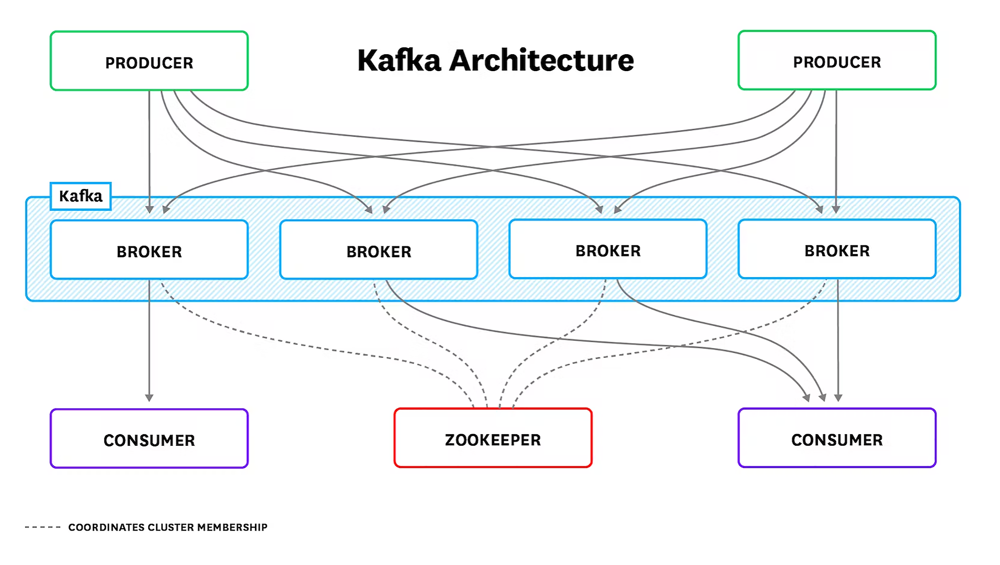

## kafka架构



上面绿色部分 `PRODUCER`（生产者）和下面紫色部分 `CONSUMER`（消费者）是业务程序，通常由研发人员埋点解决监控问题，如果是 Java 客户端也会暴露 `JMX` 指标。组件运维监控层面着重关注蓝色部分的 `BROKER`（Kafka 节点）和红色部分的 `ZOOKEEPER`。

ZooKeeper 也是 Java 语言写的，监控相对简单，可以复用下面介绍的 JMX 监控方式，另外 ZooKeeper 支持 mntr 四字命令，可以获取 ZooKeeper 内部健康状况。新版 ZooKeeper 连四字命令都不需要了，直接内置暴露了 Prometheus 协议的 metrics 接口，直接抓取即可。

我们重点关注 Broker 节点的监控，也就是 Kafka 自身的监控，通常从四个方面着手。

1. Kafka 进程所在机器的监控，重点关注 CPU、硬盘 I/O、网络 I/O。
2. JVM 监控，Kafka 是个 Java 进程，所以需要常规的 JVM 监控，通过 JMX 方式暴露。
3. Kafka 自身的指标、也是通过 JMX 方式暴露，比如消息数量、流量、分区、副本的数量等。
4. 各个 consumer 的 lag 监控，即消息堆积量，是各类 MQ 都应该监控的指标。JVM 和 Kafka 相关的指标，都通过 JMX 方式暴露，我们就先来看一下什么是 JMX，以及 Kafka 如何开启 JMX。

## 简易部署

```shell
docker-compose -f docker-compose-single-kafka.yml up -d
```

参数说明

```yaml
# 广播主机名称，一般用IP指定
KAFKA_ADVERTISED_HOST_NAME：
# Zookeeper连接地址，格式：zoo1：port1,zoo2:port2:/path
KAFKA_ZOOKEEPER_CONNECT：
# Kafka启动所使用的的协议及端口
KAFKA_LISTENERS：
# Kafka广播地址及端口，告诉客户端，使用什么地址和端口能连接到Kafka，不指定，宿主机以外的客户端将无法连接到Kafka
KAFKA_ADVERTISED_LISTENERS：
# 指定BrokerId，如果不指定，将会自己生成
KAFKA_BROKER_ID：
# topic的分区数
KAFKA_NUM_PARTITIONS: 3
# broker端的leader分区在想其他follower分区复制消息时候 ，允许的单条消息的最大值
KAFKA_REPLICA_FETCH_MAX_BYTES: 10000000
# broker的topic分区leader接受数据的时候，允许的单条消息的最大值，默认为1M
KAFKA_MESSAGE_MAX_BYTES: 10000000
# 日志文件保存120个小时
KAFKA_LOG_RETENTION_HOURS: 120
```

## JMX简介

`JMX`（Java Management Extensions）是一个为应用程序植入管理功能的框架。Java 程序接入 JMX 框架之后，可以把一些类的属性和方法暴露出来，用户就可以使用 JMX 相关工具来读取或操作这些类。

比如一个类是 Person，有 Name 和 Age 两个属性，如果把 Person 做成一个 `MBean`，我们就可以在 JConsole 里直接查到 Person 属性的值，也可以修改这些属性。

> 注：MBean 被管理的 Java 对象，JConsole 是 JMX 的一个管理工具。

我们可以通过 JConsole 直接操作 JavaBean，那 JConsole 对 JavaBean 来说是什么？打个比方吧，其实就像是 PHPMyAdmin 之于 MySQL，我们可以通过 PHPMyAdmin 直接操作数据库，这样说你大概能理解了吧。如果你没有理解也没关系，从监控的角度，我们只要知道如何通过 JMX 读取 Kafka 的指标即可。下面我们就来看一下 Kafka 如何开启 JMX 端口。

