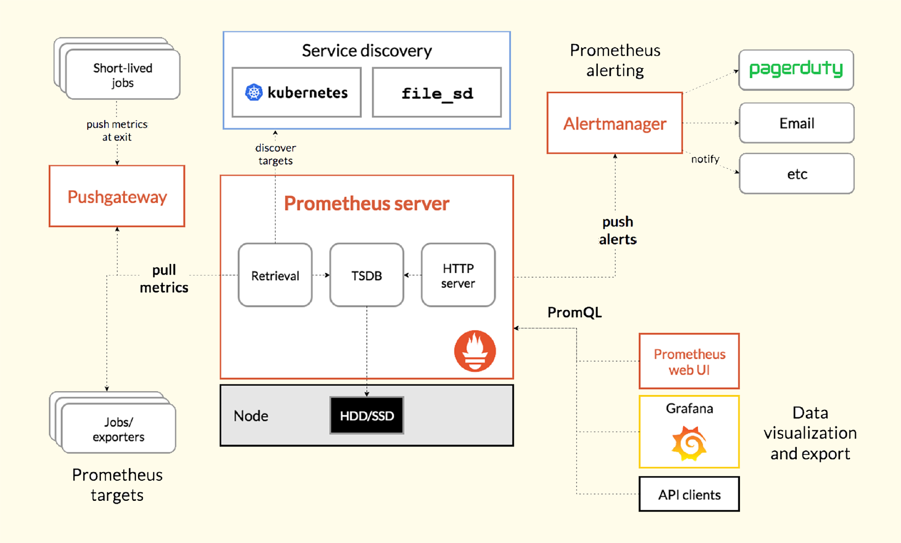
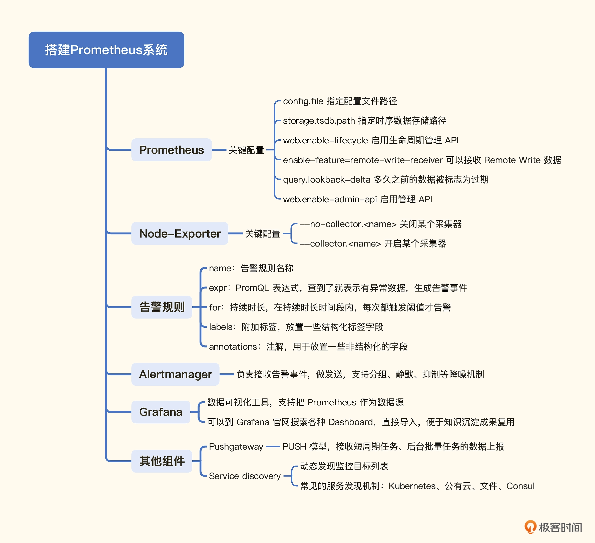
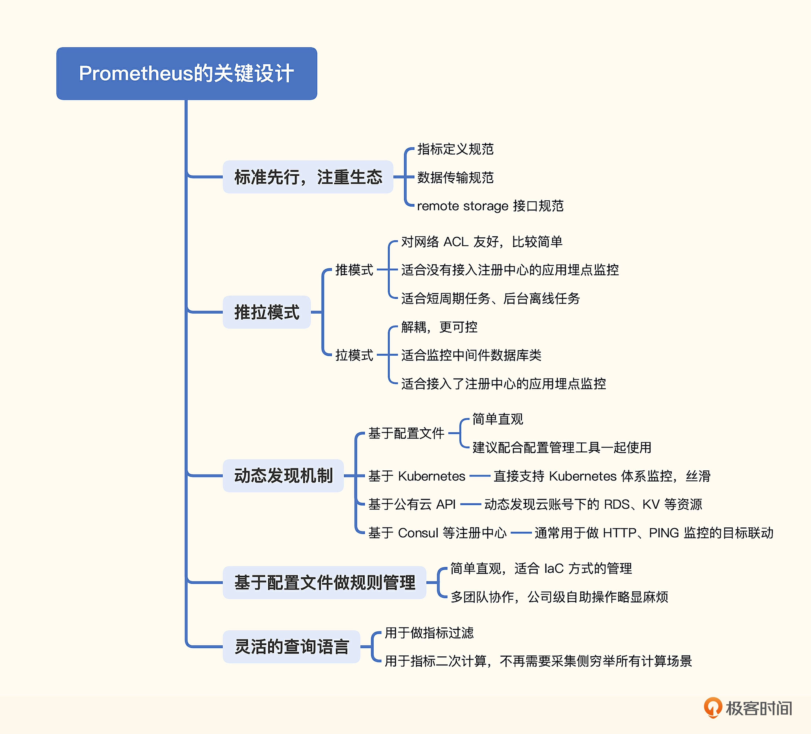

## 架构



1. Pushgateway：用于接收短生命周期任务的指标上报，是，一个是 Pushgateway 组件，另一个是 Service discovery  PUSH 的接收方式。因为 Prometheus 主要是 PULL 的方式拉取监控数据，这就要求在拉取的时刻，监控对象得活着，但是很多短周期任务，比如 cronjob，可能半秒就运行结束了，就没法拉取了。为了应对这种情况，才单独做了 Pushgateway 组件作为整个生态的补充。
2. Service discovery：我们演示抓取数据时，是直接在 prometheus.yml 中配置的多个 Targets。这种方式虽然简单直观，但是也有弊端，典型的问题就是如果 Targets 是动态变化的，而且变化得比较频繁，那就会造成管理上的灾难。所以 Prometheus 提供了多种服务发现机制，可以动态获取要监控的目标，比如 Kubernetes 的服务发现，可以通过调用 kube-apiserver 动态获取到需要监控的目标对象，大幅降低了抓取目标的管理成本。

## 搭建Prometheus系统

### 部署Prometheus

Prometheus 的下载地址：[https://prometheus.io/download/](https://prometheus.io/download/)

```shell
$ /opt/prometheus/prometheus --config.file=/opt/prometheus/prometheus.yml --storage.tsdb.path=/opt/prometheus/data --web.enable-lifecycle --enable-feature=remote-write-receiver --query.lookback-delta=2m --web.enable-admin-api

--config.file=/opt/prometheus/prometheus.yml
指定 Prometheus 的配置文件路径

--storage.tsdb.path=/opt/prometheus/data
指定 Prometheus 时序数据的硬盘存储路径

--web.enable-lifecycle
启用生命周期管理相关的 API，比如调用 /-/reload 接口就需要启用该项

--enable-feature=remote-write-receiver
启用 remote write 接收数据的接口，启用该项之后，categraf、grafana-agent 等 agent 就可以通过 /api/v1/write 接口推送数据给 Prometheus

--query.lookback-delta=2m
即时查询在查询当前最新值的时候，只要发现这个参数指定的时间段内有数据，就取最新的那个点返回，这个时间段内没数据，就不返回了

--web.enable-admin-api
启用管理性 API，比如删除时间序列数据的 /api/v1/admin/tsdb/delete_series 接口

```

服务默认启动在9090端口

同时 Prometheus 在配置文件里配置了抓取规则，打开 prometheus.yml 就可以看到了。

```yaml
scrape_configs:
  - job_name: 'prometheus'
    static_configs:
    - targets: ['localhost:9090']
```

localhost:9090 是暴露监控数据的地址，没有指定接口路径，默认使用 /metrics，没有指定 scheme，默认使用 HTTP，所以实际请求的是 http://localhost:9090/metrics。

### 部署Node-Exporter

下载 [Node-Exporter](https://prometheus.io/download/#node_exporter)

Node-Exporter 默认的监听端口是 9100，我们可以通过下面的命令看到 Node-Exporter 采集的指标。

```shell
$ curl -s localhost:9100/metrics
```

修改prometheus配置，

```yaml
scrape_configs:
  - job_name: 'prometheus'
    static_configs:
    - targets: ['localhost:9090']

  - job_name: 'node_exporter'
    static_configs:
    - targets: ['localhost:9100']
```

并且`kill -HUP <prometheus pid>`生效

```shell
$ lsof -i:9090
prometheu 8213 root
$ kill -HUP 8213
```

Node-Exporter 默认内置了很多 collector，比如 cpu、loadavg、filesystem 等，可以通过命令行启动参数来控制这些 collector，比如要关掉某个 collector，使用 --no-collector.，如果要开启某个 collector，使用 --collector.。具体可以参考 Node-Exporter 的 [README](https://github.com/prometheus/node_exporter#collectors) 。Node-Exporter 默认采集几百个指标，有了这些数据，我们就可以演示告警规则的配置了。

### 配置告警规则

Prometheus 进程内置了告警判断引擎，prometheus.yml 中可以指定告警规则配置文件，默认配置中有个例子。

```yaml
rule_files:
  # - "first_rules.yml"
  # - "second_rules.yml"
```

我们可以把不同类型的告警规则拆分到不同的配置文件中，然后在 prometheus.yml 中引用。比如 Node-Exporter 相关的规则，我们命名为 node_exporter.yml，最终这个 rule_files 就变成了如下配置。

```yaml
rule_files:
  - "node_exporter.yml"
```

这边设计一个例子，监控 Node-Exporter 挂掉以及内存使用率超过 1% 这两种情况。这里我故意设置了一个很小的阈值，确保能够触发告警。参考 [node_exporter.yml]

给 Prometheus 进程发个 HUP 信号，让它重新加载配置文件。

```shell
kill -HUP 8213
```

### 部署 Alertmanager

Alertmanager 会读取二进制同级目录下的 alertmanager.yml 配置文件。我使用 163 邮箱作为 SMTP 发件服务器，下面我们来看下具体的配置。

```yaml
global:
  smtp_from: 'username@163.com'
  smtp_smarthost: 'smtp.163.com:465'
  smtp_auth_username: 'username@163.com'
  smtp_auth_password: '这里填写授权码'
  smtp_require_tls: false
  
route:
  group_by: ['alertname']
  group_wait: 30s
  group_interval: 1m
  repeat_interval: 1h
  receiver: 'email'

receivers:
  - name: 'web.hook'
    webhook_configs:
      - url: 'http://127.0.0.1:5001/'

  - name: 'email'
    email_configs:
    - to: 'ulricqin@163.com'

inhibit_rules:
  - source_match:
      severity: 'critical'
    target_match:
      severity: 'warning'
    equal: ['alertname', 'dev', 'instance']
```

### 部署 Grafana

[Grafana](https://grafana.com/grafana/) 是一个数据可视化工具，有丰富的图表类型，视觉效果很棒，插件式架构，支持各种数据源，是开源监控数据可视化的标杆之作。

这里下载了开源版本，选择 [tar.gz](https://dl.grafana.com/oss/release/grafana-9.3.6.linux-amd64.tar.gz) 包，

下载之后解压缩，执行 ./bin/grafana-server 即可一键启动，Grafana 默认的监听端口是 3000，访问后就可以看到登录页面了，默认的用户名和密码都是 admin。

要看图首先要配置数据源，在菜单位置：Configuration -> Data sources，点击 Add data source 就能进入数据源类型选择页面，选择 Prometheus，填写 Prometheus 的链接信息，主要是 URL，点击 Save & test 完成数据源配置。Grafana 提供了和 Prometheus 看图页面类似的功能，叫做 Explore，我们可以在这个页面点选指标看图。

但 Explore 功能不是最核心的，我们使用 Grafana，主要是使用 Dashboard 看图。Grafana 社区有很多人制作了各式各样的大盘，以 JSON 格式上传保存在了 [grafana.com](https://grafana.com/grafana/dashboards/)，我们想要某个 Dashboard，可以先去这个网站搜索一下，看看是否有人分享过，特别方便。因为我们已经部署了 Node-Exporter，那这里就可以直接导入 Node-Exporter 的大盘，大盘 ID 是 1860，写到图中对应的位置，点击 Load，然后选择数据源点击 Import 即可。

### 搭建小结



## 关键设计




